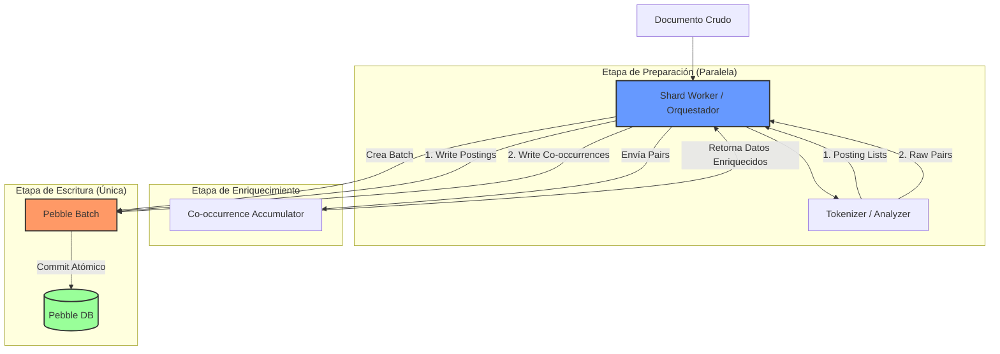

# Plastic Engine - TODO

Este documento lista las mejoras pendientes organizadas por prioridad.

## Hallazgos Prioritarios (revisión reciente)

- [x] Alta | Ingesta/Indexado: IndexWriter escribe por documento sin batching ni `pebble.Batch`; cada término fuerza fsync → bajo throughput y latencias altas. (`internal/core/search/document/worker.go`, `writer.go`) - **RESUELTO**: Implementado batching por tiempo configurable con `pebble.Batch`
- [ ] Alta | Búsqueda: Endpoint `/search` devuelve 501; no hay ejecución/merge distribuido. (`internal/adapters/http/cluster/search/router.go`)
- [ ] Alta | Consistencia (SQLite/Raft): Raft replica solo metadatos; shards Pebble no tienen replicación/snapshot. `LocalApplier` siempre “líder”, riesgo de escrituras divergentes si hay múltiples standalone. Sin TLS/auth entre coordinadores.
- [ ] Media | Ingesta resiliente: Forward HTTP sin TLS/retries/circuit breaker; un nodo lento bloquea ingesta y expone datos en claro. (`internal/core/cluster/documents/router.go`)
- [x] Media | Mappings: Search node no refresca mappings (`MappingRefresher` nil); puede indexar con esquemas obsoletos. (`cmd/search/main.go`)
- [ ] Baja | Replicación de shards: `NeedsReplication` es stub; no se copian SSTables ni se validan réplicas. (`internal/core/search/shards/manager.go`)
- [ ] Baja | Operacional: Sin backup/restore automatizado de SQLite/Pebble; sin rate limiting ni auth HTTP.

## Siguientes pasos sugeridos

1) [x] Batching de indexado con `pebble.Batch` y colas por N docs o T ms.  
2) Implementar ejecución de búsqueda (planner → fan-out por shard → merge) + tests e2e.  
3) Replicación o snapshot/restore de shards; añadir retries/circuit breaker en forwarding.  
4) [x] Integrar `MappingRefresher` en nodos search para aplicar versiones nuevas de mappings.  
5) TLS (self-signed ok) + auth + rate limiting en APIs de coordinador y búsqueda.  

## Rendimiento y Escalabilidad

### Alta Prioridad

- [ ] **Batching de documentos** (`internal/core/search/document/worker.go`)
  - Actualmente: 1 escritura por documento
  - Objetivo: Acumular N docs o T tiempo antes de flush
  - Impacto: ~4x mejora en throughput

- [ ] **Circuit breaker para nodos** (`internal/core/cluster/documents/router.go`)
  - Actualmente: Sin protección, un nodo lento bloquea todo
  - Objetivo: Implementar circuit breaker con exponential backoff
  - Impacto: Resiliencia ante fallos parciales

### Media Prioridad

- [ ] **enrichAssignments en batch** (`internal/core/cluster/nodes/service.go`)
  - Actualmente: O(N) queries para N indexes
  - Objetivo: Query batch `WHERE id IN (...)`
  - Impacto: Reduce latencia en joins con muchos shards

- [ ] **Timeouts configurables por operación**
  - Actualmente: Timeouts hardcodeados
  - Objetivo: Configuración via environment variables
  - Impacto: Mejor control operacional

### Baja Prioridad (para escala mayor)

- [ ] **gRPC streaming para ingesta**
  - Actualmente: HTTP síncrono
  - Objetivo: Streaming bidireccional con backpressure
  - Impacto: Mayor throughput, mejor manejo de carga

- [ ] **Control de compactación Pebble dinámico**
  - Actualmente: Configuración por defecto (balanced)
  - Objetivo: Estrategias adaptativas según fase del índice
    - **Write-heavy**: Durante fase de aprendizaje del LLM (muchas escrituras)
    - **Read-heavy**: Cuando el índice alcanza madurez (principalmente búsquedas)
    - **Default**: Balanced (actual)
  - Implementación:
    - `CompactionStrategy` en `IndexDefinition` (default, write_heavy, read_heavy)
    - API para cambiar estrategia: `PUT /indexes/{id}/compaction`
    - Auto-detección opcional basada en métricas (write/read ratio)
    - Migración gradual de shards existentes
  - Impacto: Optimización automática según ciclo de vida del índice
  - Nota: Dejar default balanced por ahora, implementar cuando haya necesidad real

## Funcionalidad

### En Progreso

- [ ] **Módulo de Mappings independiente**
  - Separar mappings de indexes
  - Dynamic mapping (inferencia de tipos)
  - Versionado de mappings para plasticidad

### Pendiente

- [ ] **Search Query Module**
  - Parser de queries
  - Ejecución distribuida
  - Agregaciones básicas

- [ ] **Stream Proxy Module**
  - Fan-out de queries a nodos
  - Merge de resultados
  - Streaming de resultados al cliente

- [ ] **Plasticity Module**
  - Cambios de mapping controlados
  - Resharding
  - Migraciones de datos

## Operacional

- [ ] **TLS entre nodos Raft**
- [ ] **Autenticación HTTP**
- [ ] **Rate limiting**
- [ ] **Backup/Restore automatizado**

## Documentación

- [x] `docs/OBSERVABILITY.md` - Trazas y métricas
- [x] `docs/COORDINATOR.md` - Arquitectura del coordinator
- [ ] `docs/SEARCH.md` - Arquitectura de nodos de búsqueda
- [ ] `docs/API.md` - Referencia completa de la API

