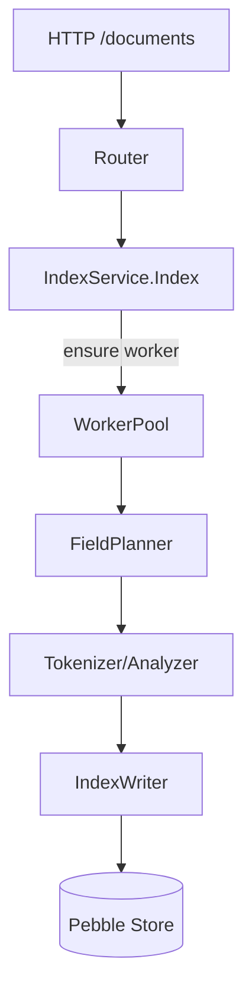
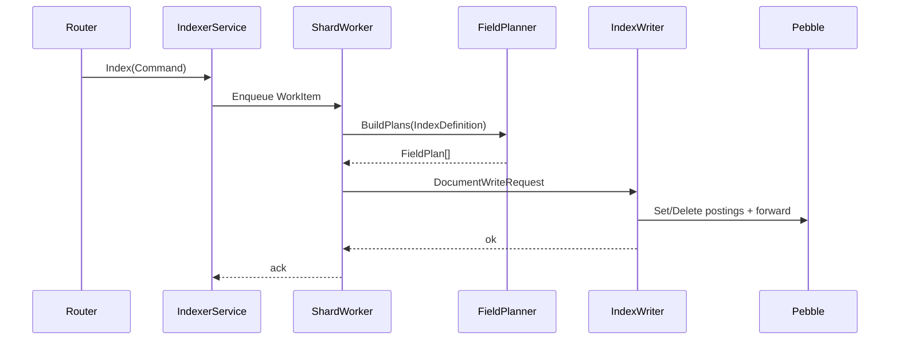

# Index Lifecycle

Los índices representan la vista lógica que consume el coordinador y los nodos search para enrutar documentos y consultas. Este documento resume la arquitectura del pipeline de indexación y las piezas involucradas desde la ingesta HTTP hasta la persistencia en Pebble.

## Arquitectura

- **HTTP Router:** valida el payload, construye `indexer.Command` y maneja errores comunes (400, 404, 503). Los documentos válidos quedan encolados en el servicio de indexación.
- **IndexerService:** mantiene un `ShardWorker` por shard disponible. Aplica backpressure cuando la cola supera la capacidad configurada. `TODO dynamic shard creation`: cuando `ErrShardNotLoaded` aparece, el coordinador deberá materializar el shard y reintentar.
- **ShardWorker:** pool de goroutines por shard (`ShardWorkerConfig`) que procesa comandos de forma asincrónica. Emite spans OTEL (`indexer.process`) y logs de diagnóstico. `TODO retry queue`: programar una cola de reintentos ante fallos transitorios.
- **FieldPlanner / Tokenizer / Analyzer:** determinan qué campos se indexan según el mapping (text → tokenizer+analyzer, keyword/integer → valor literal). El tokenizer produce offsets y posiciones; el analyzer normaliza (lowercase por defecto). El manifest del shard incluye `mapping_version`, lista de campos y configuraciones.
- **IndexWriter:** calcula el diff entre el estado anterior y el nuevo. Las claves se representan como:
  - Forward index: `fwd:<docID>` con la lista de tokens por campo.
  - Posting list: `inv:<field>:<token>:<docID>` (una entrada por documento/termino).
  `TODO batching`: agrupar writes en un `pebble.Batch` para reducir fsync cuando integremos lotes.

## Secuencia de indexación

## Notas de operación

- **Backpressure:** cuando `ShardWorker` detecta una cola llena devuelve `ErrBackpressure`, que el router traduce a `503 Service Unavailable`. Ajusta `ShardWorkerConfig.QueueCapacity` para absorber picos.
- **Metadata:** el manifest (`manifest.json`) ahora almacena analyzer/tokenizer, mappings y versión. El `AssignmentProvider` valida que el `MappingVersion` en el assignment coincida; si cambian mappings necesitamos refrescar antes de indexar.
- **Posting lists:** cada documento genera una clave independiente `inv:<field>:<token>:<docID>`. Para recuperar todos los documentos asociados a un término se itera (scan) sobre el prefijo `inv:<field>:<token>:` en Pebble. Este patrón es equivalente al recorrido de postings en motores como Lucene/Elasticsearch.
- **Cierre ordenado:** `IndexerService.Close()` detiene y espera a todos los workers, y el router responde `503` si el indexer no está disponible.

