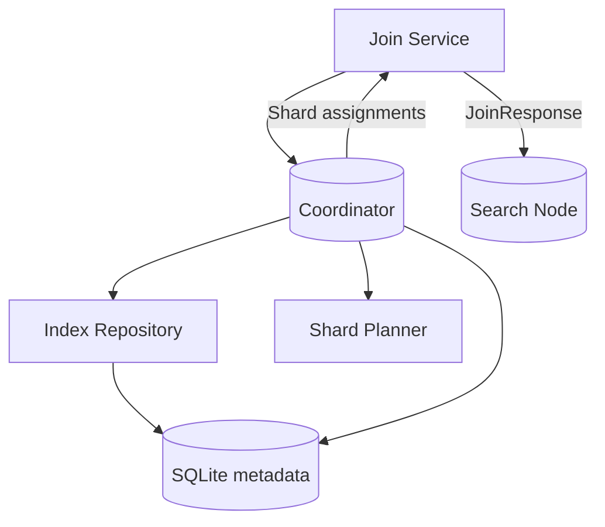
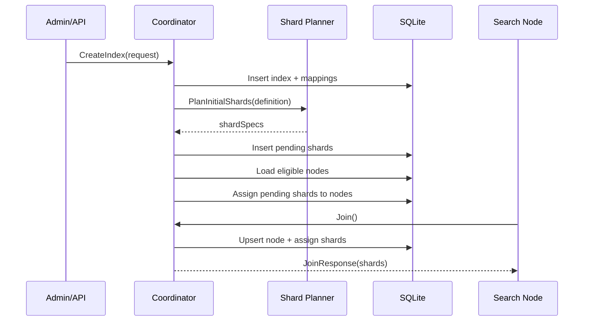
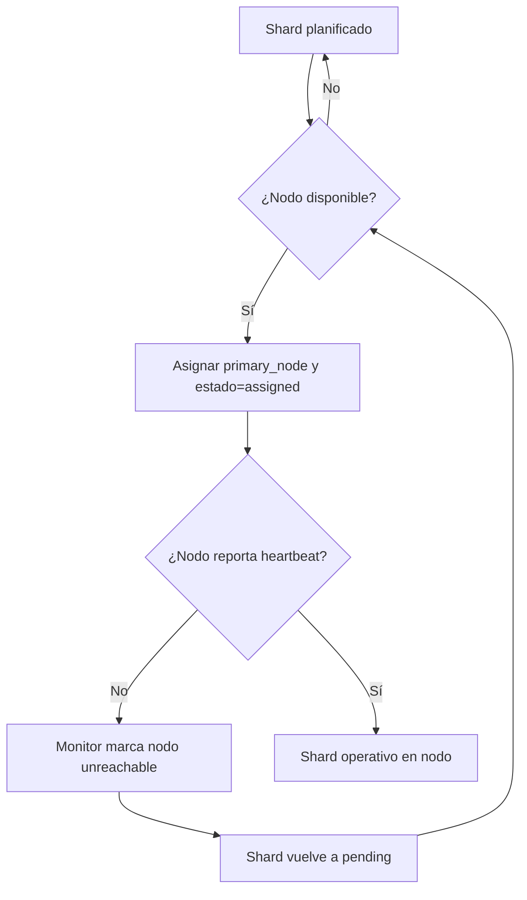

# Shards en Plastic Engine

Los *shards* son particiones lógicas del índice que permiten distribuir documentos y consultas entre múltiples nodos de búsqueda. Dividir los datos en shards habilita paralelismo, escalabilidad horizontal y tolerancia a fallas al replicar o reasignar fragmentos según la disponibilidad de la flota.

En Plastic Engine cada índice define su estrategia de particionado (por ejemplo, `automatic`, `date`, `computed`) y parámetros como analyzer/tokenizer por defecto y mappings de campos. Con esa definición, el coordinador planifica los shards iniciales, los persiste en SQLite junto con su estado (`pending`, `assigned`, etc.) y, cuando un nodo `search` hace join o queda disponible, le envía `shard.Assignment` con toda la metadata necesaria (ID, `index_id`, `shard_key`, analyzer, tokenizer, versión de mapping). Con esa información el search node prepara directorios, manifest y almacenamiento Pebble para empezar a indexar inmediatamente.

## Contratos relevantes

- `POST /indexes`: registra un nuevo índice con `IndexDefinition` y dispara la planificación inicial de shards.
- `JoinRequest` / `JoinResponse`: flujo de registro de nodos. La respuesta incluye los `shard.Assignment` primarios que el nodo debe materializar.
- Tablas SQLite:
  - `indexes`, `index_fields`: metadata de índices y mappings.
  - `shards`: por shard guardamos `index_id`, `shard_key`, `primary_node`, `state`, `version`.
  - `shard_replicas`: preparada para réplicas futuras.

## Arquitectura de componentes

El flujo arranca en la API HTTP: al crear un índice, el `Coordinator` valida la definición, la persiste a través del `Index Repository` y consulta a la factoría de planners para decidir cómo se particionará. Cada planner produce *shard keys* (por ejemplo `2025-10-buenos-aires`) que se combinan con el `index_id` para generar identificadores únicos (`{index_id}-{shard_key}`). Esos identificadores y su metadata se guardan en SQLite. Cuando un nodo `search` se presenta vía `JoinService`, el coordinator toma los shards en estado `pending`, les asigna `primary_node` y devuelve los `Assignment` necesarios para que el nodo prepare Pebble, pipeline de analyzer/tokenizer y caches locales. El repositorio y el planner se mantienen desacoplados para que podamos añadir nuevas estrategias de sharding o fuentes de metadata sin afectar el contrato HTTP.

## Secuencia de creación y asignación

1. **Creación del índice.** La API recibe el `IndexDefinition`, valida mappings y defaults, y los persiste. En este paso se versiona la metadata y se deja registrada la estrategia de sharding.
2. **Planificación de shards.** El planner produce los `shardSpecs` iniciales (por ejemplo un shard por mes y región). Cada spec genera un registro `shards` con estado `pending` y sin nodo asignado.
3. **Asignación inicial.** El coordinator consulta nodos `search` en estados `joining` o `ready`. Si hay capacidad, actualiza los registros `shards` con `primary_node`, cambia a estado `assigned`, deja constancia temporal (`updated_at`) y construye `Assignment` con analyzer/tokenizer y versión de mapping vigentes.
4. **Join de nodos.** Si un índice se creó cuando no había nodos, los shards permanecen `pending`. Cuando luego un nodo hace `join`, el coordinator reintenta la asignación dentro de la misma transacción de registro para devolver los `Assignment` en la respuesta inicial.
5. **Réplicas (futuro cercano).** La tabla `shard_replicas` nos permitirá añadir réplicas secundarias. Cuando un nodo caiga, las réplicas podrán promoverse a primarias y el coordinator buscará nuevos nodos para restablecer la redundancia.

## Ciclo de vida de un shard

El estado de cada shard evoluciona según eventos del coordinador y de los nodos:

- **`pending`:** creado por el planner y aún sin nodo asignado. Se mantiene así hasta que haya un nodo `search` elegible.
- **`assigned`:** se establece `primary_node` cuando un join o un ciclo de rebalance encuentra un nodo disponible. El coordinator entrega esta asignación en la respuesta de join y el nodo procede a crear/abrir su directorio Pebble (`data/{index_id}/{shard_id}`) y sincronizar shards.
- **`ready` (implícito en los heartbeats):** una vez que el nodo reporta el shard dentro de su payload de heartbeat, el estado operativo queda validado. Próximamente registraremos explícitamente este estado.
- **`unassigned` tras fallas:** si el health monitor marca al nodo `unreachable`, el coordinator limpia `primary_node` y devuelve el shard a `pending`. Con réplicas activas, el próximo paso será promover una réplica disponible a primaria y replanificar otra réplica.

Mientras un shard está sin nodo, el coordinator mantiene su metadata (mapping version, analyzer/tokenizer asignado) para que, al reubicarlo, el nodo pueda reconstruir su pipeline. El identificador estable `{index_id}-{shard_key}` garantiza que distintos nodos no dupliquen shards y simplifica la comparación con los assignments presentes en disco.

## Search node: layout, manifest y warm-up

- **Sync inicial (`ShardManager.Sync`).** Al recibir `JoinResponse`, el nodo recorre cada `Assignment`:
  - si requiere replicación (`NeedsReplication`), queda en cola para el flujo de réplica;
  - para shards primarios crea la carpeta `DATA_DIR/{shard_id}`, escribe un `manifest.json` con toda la metadata (index, analyzer, tokenizer, versión) y abre un `PebbleStore` dedicado.
- **Listados en memoria.** El manager mantiene un mapa `id -> Shard` con el `PebbleStore` y la metadata. Los métodos como `ListShardIDs` alimentan heartbeats y métricas.
- **Warm-up automático.** En el arranque llamamos a `loadExistingShards()`: recorre las carpetas ya persistidas, lee `manifest.json` y reabre Pebble para cada shard sin necesitar una asignación inmediata. Cuando el coordinator vuelva a enviar el mismo `Assignment`, el manager detecta que el shard ya está cargado.
- **Cierre ordenado.** `Manager.Close()` cierra todos los `PebbleStore` abiertos; debería ejecutarse en la secuencia de apagado del search node para liberar locks en disco.
- **Próximos pasos.** El manifest también servirá para reconstruir pipelines de tokenizer/analyzer; cuando esos componentes estén implementados, el nodo podrá instanciarlos usando los campos guardados. Más adelante agregaremos lógica para limpiar shards desasignados y para promover réplicas si `NeedsReplication` indica un cambio de rol.

## Ingesta de documentos

- **Endpoint del coordinator.** `POST /indexes/{index_id}/documents` recibe `document_id` y un `payload` arbitrario (que reenvíamos sin persistir). Opción `routing` queda como override opcional. El coordinator valida que exista un primario para el shard objetivo, calculando la clave con `ComputeShardKey` según la estrategia declarada en el índice.
- **Selección de shard.**  
  - `automatic` ⇒ usa el `document_id` (o el campo configurado) para hashear y elegir entre `h00`, `h01`, …; con `shard_count = 1` se mantiene el shard `default`.  
  - `date` ⇒ proyecta el campo `date` indicado en el mapping al bucket configurado (`year`, `month`, `day`).  
  - `computed` ⇒ concatena los campos declarados en `routing_path` aplicando la normalización elegida (`exact`, `slug`).  
  Si el shard no existe o no tiene `primary_node`, responde con error (`404` o `502` según el caso).
- **Forward al nodo search.** Se construye un request `POST {advertise_addr}/documents` con `index_id`, `shard_id`, metadata de routing y el cuerpo original. Por ahora el nodo sólo confirma con `202 Accepted`; el pipeline de indexación se implementará a continuación usando la metadata del manifest y los stores Pebble preparados.
- **Recuperación de postings.** Cada documento genera claves `inv:<field>:<token>:<docID>`. Para obtener todos los documentos asociados a un token se itera sobre el prefijo `inv:<field>:<token>:` en Pebble (al estilo de las posting lists de Lucene/Elasticsearch).

